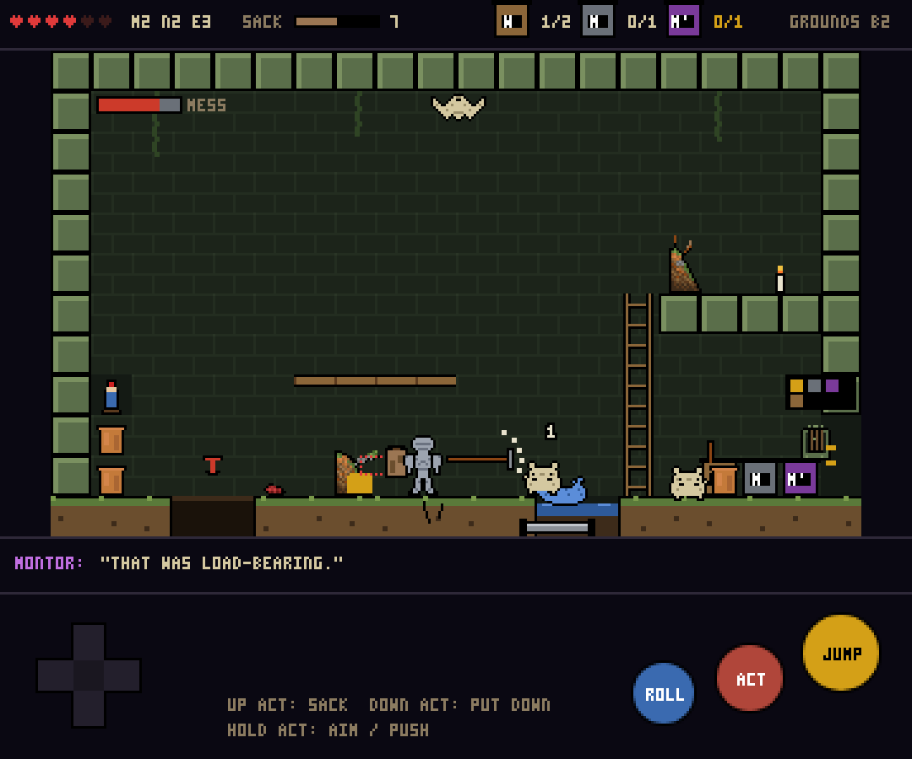

# Montor's Descent -- Game Spec v1

> The junk platformer. Snap-to-grid, three stats, fixed Montor lines.
> Supersedes the mechanics in [platformer_mode_spec.md](platformer_mode_spec.md) (v0.1, the faithful Crawl port) -- that doc's tech notes on rooms, sprites and the engine loop still apply. Directions chosen from [platformer_design_options.md](platformer_design_options.md): C (wear the house) + E (dig) + D (tidy) as the loop, H (the sack) as the pressure, G (treasures) as the goal.
> Written 2026-09-24. Status: **spec -- nothing built.**
> Gameplay view PoC image: 

---

## 1. One paragraph

You're a knight breaking into a hoarder's house. Every room is a single screen on a 16px grid, full of Montor's junk. You pick things up and hit rats with them until they break. You dig through piles to find what's buried. You sort the mess into bins to open the good door, or kick it all down the hole and take the bad one. Everything you keep goes in a sack that gets heavier. Somewhere on each floor are the pieces of one thing Montor loves; put it back together and he gives you a Gift, and a line. Seven floors down is Montor.

---

## 2. Decisions locked in

| Question | Answer |
|---|---|
| Grid or physics? | **Snap-to-grid.** Objects occupy whole tiles. Throws are arcs that land on a tile. Stacks are columns. No wobble, no ragdoll. |
| Stats? | **Three: MIGHT, NIMBLE, EYE.** Each 1-5. Start 2/2/2. That's it for this mode. |
| Montor's voice? | **Fixed lines** from a JSON pool, keyed by event. No AI calls. |
| Combat resolution? | **No dice.** Deterministic damage from the object. Randomness lives in what's inside piles and where enemies spawn. |
| Shared with the Crawl? | Sprites, floor themes, enemy roster, junk names, the 6 Treasures/Gifts, Montor's mood pillars, the Tavern hub. Not stats, items-as-equipment, conditions-as-a-system, or the d20. |

---

## 3. The grid

- Room = **20 x 12 tiles** of 16px (320 x 192), integer-scaled. Same as v0.1.
- Everything snaps: the knight stands on a tile, objects sit on tiles, enemies move tile to tile with smooth interpolation (like Spelunky's feel with Zelda-2's rules).
- The knight is 1 tile wide, 2 tall. Jumps 3 tiles high, clears 4 wide. Can climb ladders, drop through one-way planks, push things.
- **Tile types:** solid, one-way plank, ladder, water (1 tile deep), hazard (spikes / wire / fire), breakable (cracked wall, floorboard), bin (wood / metal / Montor's), plinth, door, hatch, hole.

---

## 4. The three stats

| Stat | 1 | 3 | 5 | What it touches |
|---|---|---|---|---|
| **MIGHT** | can carry light only, throws 3 tiles, 1 swing to break a pot | medium objects, 5 tiles, pushes crates | heavy objects (wardrobe), 7 tiles, breaks walls with a mace | Carry class, throw range, damage multiplier, push |
| **NIMBLE** | 1 jump, slow swing, no roll | dodge-roll (2 tiles, invulnerable), faster swing | double-jump, roll through enemies, swing while rolling | Movement, i-frames, attack speed |
| **EYE** | sees the top layer of a pile only | sees silhouettes 2 layers deep, spots traps within 3 tiles | sees whole pile contents, cracked walls glow, Mimics are obvious | Pile preview, trap/secret reveal, Mimic tell |

- Stats are raised by **eating Montor's food** found in piles (the existing consumable junk: Strange Mushroom, Dried Flowers, Worm...). Each is labelled with which stat it might raise. Risky ones can also lower one. That's the whole progression: no XP, no level-ups.
- **Max HP** is fixed at 6 hearts. Hearts are refilled at the safe room and by rare food. No VIT.
- The knight's appearance changes with worn junk, not stats.

---

## 5. Junk objects

Every entry in `junk.json` becomes an object. Each gets four fields (new data, `descent-objects.json`, keyed by junk id):

```json
"cracked_pot":      { "size": 1, "weight": "light",  "material": "ceramic", "use": "throw",  "hits": 1 },
"snapped_rake":     { "size": 2, "weight": "light",  "material": "wood",    "use": "swing",  "hits": 4, "reach": 2 },
"tangled_hose":     { "size": 2, "weight": "light",  "material": "rubber",  "use": "whip",   "hits": 8, "reach": 3 },
"broken_gnome":     { "size": 1, "weight": "medium", "material": "ceramic", "use": "throw",  "hits": 99, "returns": true },
"bird_bath_chunk":  { "size": 1, "weight": "heavy",  "material": "stone",   "use": "block",  "hits": 6 },
"faded_label":      { "size": 1, "weight": "light",  "material": "paper",   "use": "none",   "fragment": "gnome" }
```

- **size**: tiles it occupies when placed (1 = pot, 2 = rake, 3 = plank, 4 = wardrobe).
- **weight**: light / medium / heavy -> which MIGHT can lift, and how much it fills the sack.
- **material**: wood *burns*, metal *conducts* and *clangs* (wakes enemies), ceramic *shatters*, cloth *soaks*, organic *rots* and *burns*, paper *burns instantly*, rubber *stretches*, stone *sinks*.
- **use**: the one verb when held. `swing`, `throw`, `whip`, `block`, `wear`, `none`.
- **hits**: durability. 0 = broken -> becomes a smaller object or vanishes (pot -> shards, shards are a 1-hit throwable).

### Verbs (what the player can do)

| Input | Holding nothing | Holding something |
|---|---|---|
| Action | Pick up the object in front / dig the pile in front / talk / open | **Use** it (swing / throw / whip / raise block) |
| Action (hold) | Push the object in front one tile | Aim the throw (shows landing tile) |
| Down + Action | -- | Put it down here (snaps to tile). Stacks on top of what's there |
| Up + Action | -- | Wear it, if `wear`. Or put in sack |
| Jump | Jump | Jump (heavy = 2 tiles instead of 3) |
| Roll (NIMBLE 3+) | Dodge roll | Dodge roll (drops heavy objects) |

No inventory screen during play. What you're holding is in your hands; what you're keeping is in the sack; what you're wearing is on you. That's the whole UI.

### Stacking

- Put an object down on another and it sits on top. A column of light objects up to 3 high is stable. Anything on a medium is stable. A heavy on anything light **crushes** it (pot shatters, gets you shards).
- You can stand on stacks. This is how you reach ledges. Stacks persist when you leave the room.
- Enemies knock stacks over by walking into them. Rats climb them.

---

## 6. Combat

No dice, no conditions system. Damage is the object's number times a MIGHT multiplier, and the knight takes 1 heart per hit (2 from Crimson tier, 3 from bosses).

| Held object use | Damage | Feel |
|---|---|---|
| **swing** (rake, trowel, bread knife, mace) | 1 per hit, 2 if metal, ×1.5 at MIGHT 4+ | Arc in front, `reach` tiles. Durability drops per hit |
| **throw** (pot, gnome, football, bird bath) | 1 light / 2 medium / 3 heavy | Lands on the aimed tile. Ceramic shatters and hits adjacent tiles for 1 |
| **whip** (hose, belt, curtain cord) | 1, pulls the enemy 1 tile toward you | Sets up throws-into-hazards |
| **block** (pot lid, tray, bird bath) | 0 | Hold to face-tank. Metal blocks reflect thrown things |
| **fists** (nothing) | 1, MIGHT 3+ can grab a small enemy and throw it | Always available. Grabbed rats are ammo |

**Materials as the only "elemental" system:**

| Combo | Effect |
|---|---|
| Wood or paper object + fire tile / candle | Burns for 3 seconds. Burning object thrown = fire on landing tile |
| Enemy in water + metal object thrown at it | **Zap** -- 3 damage, stuns everything in that water |
| Ceramic thrown | Shatters, 1 damage to all 8 neighbours |
| Organic junk left in a room | Attracts rats and moths over time (the room's mess grows) |
| Heavy object dropped from 3+ tiles | Crushes whatever is beneath (enemy, pot, floorboard) |

That's the whole reaction table. It replaces 18 conditions with five rules you can see.

**Enemy hits on you:** contact = 1 heart, 1 second of invulnerability, knocked back 1 tile. At 0 hearts the run ends; banked Gifts survive (same as the Crawl).

---

## 7. Piles (digging)

A pile is a **stack of 1-4 layers**, each layer holding 0-3 objects. It's drawn with the existing `junk_garden_1/2/3` sprites (small = 1-2 layers, heap = 2-3, mound = 3-4).

- Hit a pile (any swing, or fists) to **spill the top layer**: its objects pop out onto adjacent tiles. Repeat for the next layer.
- **EYE** shows what's inside before you hit: EYE 1 sees nothing, EYE 3 sees silhouettes of the next 2 layers, EYE 5 sees everything and colours traps red.
- **One layer per pile can be a trap**: a spring blade (1 heart unless you roll), a pot that falls from above, a Mimic (the pile *is* the enemy -- EYE 5 tells you), or a rat nest (3 rats). Traps guard the layer beneath, which is always the best one.
- **The bottom layer of one mound per floor holds a treasure fragment.** EYE 3+ shows a faint gold outline through the pile from across the room.
- Burn a pile (drop a lit wooden thing on it): it clears all layers in 4 seconds, organic and paper contents are destroyed, ceramic and metal survive. Fast, greedy, and Montor hates it.
- Piles do **not** regrow. Rooms remember.

---

## 8. Tidy or trash (leaving a room)

Every room has **two ways out** once enemies are dead:

- **The tidy door.** Locked. Above it, three bin icons show what's needed: e.g. *2 wood, 1 metal, 1 Montor's*. Throw or place the right junk in the right bin (wood bin, metal bin, and the *Montor's* box for anything with his name on it). Fill the quota and the door opens. Tidy exits lead to the **better neighbouring room** (the one with the merchant, the treasure fragment, the chest).
- **The trash exit.** Always open. A hole, a hatch, a broken window. Take it and leave the mess. It leads somewhere, but Montor's **mood** drops.

Bins accept anything of the right material; putting a *Montor's* item in the wood bin because it's wooden is allowed but he notices ("That was my gran's").

Rooms show a small **mess meter** in the corner: junk on the floor vs. junk in bins. Enemies push it up (rats drag things out of bins). It's saved when you leave.

---

## 9. The sack

- Up + Action on a held object puts it in the sack. No limit.
- The sack is drawn on the knight's back and grows: 0-3 items small, 4-8 medium, 9+ huge and dragging.
- Cost of weight (sum of light=1, medium=2, heavy=4):

| Sack weight | Effect |
|---|---|
| 0-4 | none |
| 5-9 | jump 2 tiles, not 3 |
| 10-15 | jump 2, walk slower, **floorboards creak** -- cracked floor tiles break under you (you fall to the room below, which is a legit exit, but you land hard: 1 heart) |
| 16+ | can't jump. Rats steal from the sack on contact. Mimics target you first |

- **The safe room** between floors is the only place to empty it: items sell for their `sellPrice` (gold buys food, keys, and a bigger sack), or go into the **Dump** for permanent unlocks (existing backlog item), or are *given to Montor* (mood up, gold none).
- Gold has one job: the safe room shop. No merchants in rooms in v1.

---

## 10. Treasures (the floor goal)

Each floor's Treasure from `junk.json` (Gerald the Gnome, the Gravy Boat, the Toilet Seat, the Music Box, the Tongs, the Night Light) is split into **3 fragments** placed in mound bottoms across the zone. Fragments are `fragment: "<treasure>"` objects: light, size 1, use `none`, and they **crack** if thrown or dropped from height (3 cracks = it becomes junk; you can still finish the treasure but the Gift is weaker).

- The **plinth room** is the zone's old "terminal" chamber. Place all 3 fragments on the plinth -> the treasure assembles -> Montor's fixed `montorReaction` line plays -> you pick a **Gift** slot (existing Petal / Stone / Bile / Blood / Ember / Void, existing 5-slot UI, reused as an overlay).
- The **stairs down** unlock when the treasure is assembled OR when the boss is dead. Both = the boss drops a 4th bonus piece (a cosmetic: the gnome's hat), which is worth mood.
- Gifts in Descent are simplified to one effect each, chosen to fit the verbs:

| Gift | Descent effect |
|---|---|
| Petal | Organic junk you throw grows a vine bridge for 5 s |
| Stone | Heavy objects count as medium in the sack; you can throw stone |
| Bile | Shattered ceramic leaves a puddle that rots enemies (1/s for 3 s) |
| Blood | Every 5th hit with a swing object heals 1 heart |
| Ember | Anything wooden you hold is lit; you're immune to your own fire |
| Void | The sack has no weight for 10 s after entering a room |

Banked Gifts from the Crawl carry into Descent and back (shared `characterSave.js`).

---

## 11. Montor's lines (fixed)

One JSON file, `descent-montor.json`. Each event has 3-6 lines; one is picked at random, never the same twice in a row. He speaks in a text box at the top, pixel font, purple, 2.5 seconds, never blocks play. Existing `montorWhispers` are reused for the idle pool.

| Event | Example |
|---|---|
| `enter_room` (idle pool, 20% chance) | "Every door you open was already open. I left them that way." |
| `first_pickup` (once) | "Put that down. ...No, actually. Let's see what you do with it." |
| `break_object` | "That was load-bearing." / "Fine. I have nine more." |
| `break_montors_object` | "That was my gran's." / "I'm going to remember this." |
| `burn_pile` | "Oh, we're *burning* things now." |
| `tidy_exit` | "...Thank you. Don't tell anyone." |
| `trash_exit` | "Leave it. Leave all of it. I'll do it myself. As usual." |
| `sack_heavy` (first time past 10) | "You look ridiculous." |
| `sack_huge` (first time past 16) | "The floor has opinions about you." |
| `floor_collapse` | "Told you." |
| `fragment_found` | "Don't drop that. *Don't.*" |
| `fragment_cracked` | "..." (literally three dots, the only silent line) |
| `treasure_assembled` | The existing `montorReaction` per treasure ("Gerald! ...I raised him from a pebble.") |
| `boss_enter` | Per boss, hand-written |
| `death` | "Leave your sack on the way out." / "I'll put you with the others." |
| `mood_low` (mood drops below threshold) | "I've stopped pretending to like you." |
| `mood_high` | "Stay. There's a room I haven't shown anyone." |

Mood is a single -10..+10 number: tidy exits +1, trash exits -1, breaking his named items -2, giving him things at the safe room +2, burning piles -1. It gates safe-room offers (existing tonics/curses concept) and the two endings (tidy: he asks you to stay; messy: he throws you out with everything you carried).

---

## 12. Enemies

Same 12 archetypes and sprites, same tier colours by floor. In Descent each is one rule plus one thing it does to junk:

| Enemy | Moves | Does to junk |
|---|---|---|
| Rat | Runs, climbs stacks, flees at 1 HP | Drags an object out of a bin. Steals from a heavy sack |
| Slug | Slow, on walls and ceilings | Leaves slime tiles: objects placed there slide off |
| Orc | Walks, charges when it sees you | Smashes any stack it walks into |
| Rock Monster | Slow, ground-pound | Its pound knocks every loose object 1 tile |
| Wraith | Floats through walls | Carries an object away when it leaves |
| Spider | Drops from ceiling on a thread | Webs a pile shut (must burn or cut) |
| Mimic | Pretends to be a pile or chest | Eats the object you throw at it. Full Mimics (3 objects) explode into all of them |
| Bat | Swoops in waves | Knocks what you're holding out of your hands |
| Hound | Runs and leaps | Fetches thrown objects back to *its* side |
| Automaton | Patrols, fires bolts | Bolts are metal: they conduct in water |
| Shade | Teleports between shadows | Swaps two objects' positions |
| Moth | Swarms lights | Eats cloth and paper objects |

HP: 1-4 depending on tier (Dust 1, Slate 2, Iron 3, Crimson 4, Void 5). Bosses 15-25 with a pattern and a room-sized junk gimmick (Garden boss: a giant Mimic gnome that you fill with junk until it bursts).

---

## 13. Floors

Same 7 floors. Each adds **one new rule** so the game keeps changing:

| Floor | New rule | Local junk (from `junk.json` pools) |
|---|---|---|
| 0 Grounds | The basics: pick up, throw, dig, bins | Pots, hose, gnome, rake, bird bath |
| -1 Underground | **Ladders and shafts**: rooms are taller (20x24, scrolls vertically) | Furniture: chairs (2 tiles), lamps, books |
| -2 Underbelly | **Water everywhere**: half the floor is water; metal conducts; wet paper is useless | Pipes (metal), bottles, wet newspaper |
| -3 Quarters | **Fragile everything**: most junk is 1-hit ceramic and glass; Montor's items are common (mood matters) | Vases, photos, music box parts, cutlery |
| -4 Works | **Fire and metal**: braziers everywhere; wood is ammo; a forge lets you *repair* one object per room | Tongs, gears, bellows, coal |
| -5 Deep | **Dark**: you see 3 tiles unless holding a light (candle, night light fragments) | Candles, bones, crystals |
| -6 Domain | **Montor's rules**: no bins; everything is his; the mood decides the ending | The Throne room is one big room |

Each floor is one 4x4 zone from `generateZone` in v1 (the Crawl's 13-zone layout can come later). Rooms are picked from hand-made templates per floor (~10 each), then decorated: which piles, which junk, which enemies.

---

## 14. Screen and controls

```
 ┌──────────────────────────────────────────────┐
 │ ♥♥♥♥♡♡   M3 N2 E3   [sack ▮▮▮░░ 7]  wood 1/2 metal 0/1 M 0/1 │  <- HUD (hearts, stats, sack, bin quota)
 ├──────────────────────────────────────────────┤
 │                                              │
 │               the room (320x192)             │
 │                                              │
 ├──────────────────────────────────────────────┤
 │  MONTOR: "That was load-bearing."            │  <- Montor line strip (only when speaking)
 ├──────────────────────────────────────────────┤
 │   ◄ ►  ▲ ▼            [ROLL]  [ACT]  [JUMP]  │  <- touch controls (portrait); hidden on keyboard/gamepad
 └──────────────────────────────────────────────┘
```

- Keyboard: arrows/WASD, Z jump, X action, C roll. Gamepad: A jump, X action, B roll.
- Touch: d-pad left, three buttons right. Hold ACT to aim throws / push.
- Pause menu: map (existing `DungeonMap.jsx`), sack contents (read-only list), what you're wearing, quit-to-Tavern.

---

## 15. Data and code

New files (ES5 style, matching the codebase):

```
src/data/
  descent-objects.json      size / weight / material / use / hits per junk id (+ fragments, food -> stat)
  descent-rooms.json        room templates: tiles, exits, spawn tiles, pile slots, bins, plinth
  descent-montor.json       fixed lines per event
  descent-enemies.json      per-archetype: hp by tier, move rule, junk rule, speed
src/descent/
  engine.js                 fixed-step loop, pause, room transitions
  grid.js                   tile map, occupancy, stack rules, one-way / ladder / hazard checks
  objects.js                object instances, durability, materials, break -> shards
  player.js                 knight: move/jump/roll, hold/throw/place/wear/sack, 3 stats
  piles.js                  layers, spill, EYE preview, traps, burn
  bins.js                   quota per room, tidy door, mess meter, mood deltas
  enemies.js                one movement rule + one junk rule per archetype; bosses
  montor.js                 event -> line picker, mood number
  render.js                 tiles + sprite cache (reuses lib/sprites.js grids), sack sprite, silhouettes
  input.js                  keyboard / gamepad / touch
  save.js                   localStorage `dom_descent_run_v1`, per-room state
pages/Descent.jsx           canvas mount + HUD + pause overlays; Tavern tile + App route
```

Reused as-is: `lib/sprites.js` (all grids + tier colours), `lib/dungeon.js` (`generateMaze` for the 4x4 layout), `data/junk.json` (names, pools, treasures, food), `data/themes.json`, `DungeonMap.jsx`, Gift slot overlay, `characterSave.js` for banked Gifts.

**New art:** knight side-on frames (idle, run 4, jump, fall, swing, throw, roll, climb, carry-heavy), the sack in 3 sizes, 16px tile sets per floor, bins (3), plinth, shards, fire, silhouette overlay (a flat dark-blue mask of the object grid). All in the K/C/S grid format.

---

## 16. Build plan

| Phase | Build | Playable question |
|---|---|---|
| **P0** | One Garden room, grid movement, pick up / throw / swing / put down, three objects (pot, rake, gnome), one rat | Is hitting a rat with a rake that breaks fun? |
| **P1** | Piles with layers and spill, EYE silhouettes, one trap type, stacking to reach a ledge | Does digging beat tapping? Does stacking feel good on a grid? |
| **P2** | Bins + tidy door + trash hole, mess meter, mood number, 10 Montor events with lines | Does anyone tidy? Does Montor land? |
| **P3** | The sack, weight tiers, creaking floors, safe room (sell / dump / give) | Does weight create decisions? |
| **P4** | Full Garden: 4x4 maze from templates, 4 enemy types, fragments + plinth + Gift overlay, Garden boss, stairs, death + banked Gifts, Tavern tile | A complete Floor 0 |
| **P5** | Floors -1 to -3 with their rules, 8 more enemies, food-as-progression | Does each floor feel new? |
| **P6** | Floors -4 to -6, both endings, polish, balance, ship to main | Full run |

Stop at any phase where the answer is no and rethink before continuing.

---

## 17. Open questions (small ones)

1. Should the trash exit *ever* lead to the better room? (Proposal: 20% of the time, so it isn't a pure punishment.)
2. Is 6 hearts right, or should hearts be found as junk (a Bread Knife heart container)?
3. Do worn items (colander, pot lid) give a heart of armour, or are they purely cosmetic in v1? (Proposal: cosmetic in v1, one armour heart in P5.)
4. Should stat food be identifiable (EYE reveals the label) or always a gamble?

---

*Montor's Descent -- Game Spec v1 -- September 2026*
